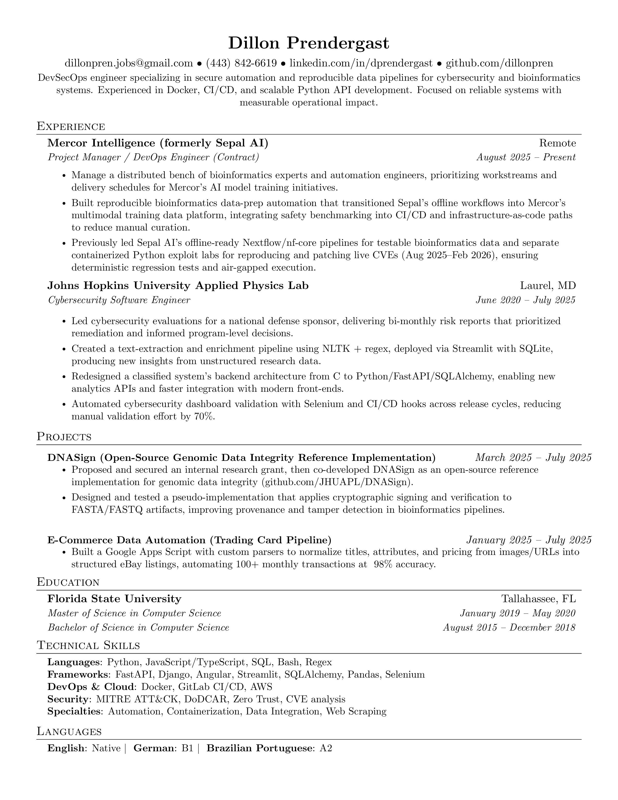

# Resume
LaTeX template and build tooling for my personal resume.

Based off of [jakegut/resume](https://github.com/jakegut/resume)

### Build locally
Requirements:
- `latexmk` (recommended) or `pdflatex`
- ImageMagick (`magick` or `convert`) for JPG generation

Commands from the repo root:

```bash
make           # builds PDF and JPG (requires resume.tex at repo root)
make pdf       # rebuilds Resume_DillonPrendergast.pdf (requires resume.tex at repo root)
make jpg       # builds Resume.jpg from the PDF
make template  # builds Resume_Template.pdf and Resume_Template.jpg
make template-pdf
make template-jpg
make clean     # removes build artifacts
```

Notes:
- This public repo is artifact-first; `Resume_DillonPrendergast.pdf` is prebuilt.
- If `resume.tex` is absent, `make pdf` will fail by design.
- Build artifacts and archives are stored under `build` and `archive`.
- Outputs are written to `Resume_DillonPrendergast.pdf` and `Resume.jpg` at the repo root.
 - Template outputs are `Resume_Template.pdf` and `Resume_Template.jpg` at the repo root.

### Public template
This repository includes a public template with dummy data: `template/resume-template.tex`.

To preview the template:

```bash
pdflatex -interaction=nonstopmode -halt-on-error template/resume-template.tex
```

Or open it in Overleaf.


